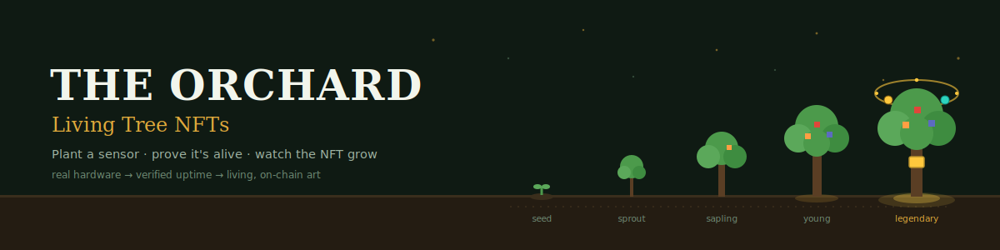
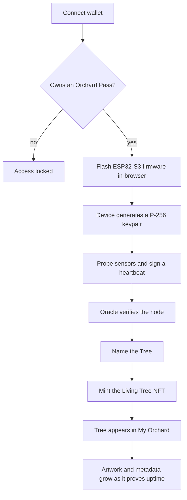

[](https://theorchard.network)

# 🌳 The Orchard — Living Tree NFTs

**Dynamic, upgradeable Chia NFTs bound to real-world sensor hardware.**
Plant a physical sensor node, prove it's alive, and watch its NFT *grow* — the artwork becomes a living audit trail of the hardware's entire life.

> Part of [The Orchard](https://theorchard.network) · built on the [Chia blockchain](https://www.chia.net) · repo: [FlipThisCrypto/CHIP-0021-NFT-POC](https://github.com/FlipThisCrypto/CHIP-0021-NFT-POC)

---

## TL;DR

The Orchard has two NFT collections:

1. **Orchard Pass** *(existing, unchanged)* — your access key. Owning one unlocks the ability to plant Trees.
2. **Living Tree** *(this project)* — one NFT per **verified physical sensor node**. Each Tree is cryptographically bound to its device and **evolves over time** as the device proves uptime, adds sensors, and earns rewards.

The **Pass** is the gateway. The **Living Tree** is the planted hardware identity. The **Oracle** is the truth layer. **JUICE** (a Chia CAT) is the reward layer. The artwork is how you read it all at a glance.

> ### ⚠️ Project status: early proof-of-concept (as of 2026-06-20)
> **What runs today (zero-install — Node + a browser):** the metadata schema + [growth rules](specs/growth-rules.md); a deterministic **artwork renderer**; a verified **device-binding crypto demo**; and a complete **end-to-end Oracle testbed** — register a device, grow it through every stage, mint, watch it in an operator **dashboard**, and claim JUICE, all driven by real P-256 signatures. `npm test` runs the whole thing (8 checks, including a 27-assertion integration test). See [Run the full testbed](#run-the-full-testbed-end-to-end).
> **What is still *mocked* (vs. production):** a persistent database, real Chia wallet-RPC minting + on-chain metadata anchoring, the on-chain Pass lookup, firmware on real hardware, and DataLayer. The testbed mocks the chain so everything else runs for real.

---

## Contents

- [The concept](#the-concept)
- [The vision (end-to-end flow)](#the-vision-end-to-end-flow)
- [Quick start — run the artwork renderer](#quick-start--run-the-artwork-renderer)
- [Run the full testbed (end to end)](#run-the-full-testbed-end-to-end)
- [Repository structure](#repository-structure)
- [How it works](#how-it-works)
  - [Binding a device to a Tree](#binding-a-device-to-a-tree)
  - [The three-tier metadata model](#the-three-tier-metadata-model)
  - [Oracle custody](#oracle-custody)
- [The living artwork — Heartwood](#the-living-artwork--heartwood)
- [Locked technical decisions](#locked-technical-decisions)
- [Roadmap](#roadmap)
- [MVP vs. deferred](#mvp-vs-deferred)
- [Tech stack](#tech-stack)
- [Pending sign-offs](#pending-sign-offs)
- [Glossary](#glossary)
- [Reference links](#reference-links)
- [Contributing](#contributing)

---

## The concept

| Layer | What it is |
|---|---|
| 🪪 **Orchard Pass** | Existing access-pass NFT. Ownership gates firmware flashing, Tree registration, and minting. *A pass is a pass — it never changes.* |
| 🌳 **Living Tree NFT** | One NFT per verified device. Carries immutable identity + a living, Oracle-driven state. The permanent on-chain identity of one physical node. |
| 🔮 **Oracle** | The truth layer. Verifies devices, validates sensors, calculates uptime, gates rewards, and writes the Tree's on-chain state. |
| 🧬 **CHIP-0021 / metadata updater** | The upgrade mechanics (see [note below](#a-note-on-chip-0021)). |
| 🧃 **JUICE** | The reward layer — an already-minted [Chia CAT](https://chialisp.com/cats/). Trees accrue JUICE for proven uptime; owners claim it on-chain. |
| 📊 **Dashboards** | The experience layer — *My Orchard* for owners, an admin console for operators, and a live globe of the network. |

### A note on CHIP-0021

The project name references **[CHIP-0021](https://github.com/Chia-Network/chips/blob/main/CHIPs/chip-0021.md)**, which is the Chia standard for **NFT *fusion*** — combining, splitting, and upgrading NFTs by swapping them through the offer system (each upgrade mints a *new* launcher ID, with provenance preserved).

That is **not** the same as "edit the metadata in place." For a Tree that must stay the **same NFT** as it grows, routine evolution (uptime, health, new fruit, growth stage) uses the **standard NFT1 metadata updater** — appending a new metadata URI on the *same* launcher. CHIP-0021 fusion is reserved for genuinely *combining* assets later (e.g. two Trees into a grove, or fusing an event NFT into a Tree). Both mechanisms are in scope; they do different jobs.

---

## The vision (end-to-end flow)



A user owns a Pass. That Pass lets them plant real-world sensor Trees. They flash a device, plug in sensors, verify the node, name the Tree, and mint a Living Tree NFT. As the device stays alive, reports data, and gains sensors, the NFT **grows, earns, and changes** — becoming the permanent, increasingly valuable identity of that physical node.

---

## Quick start — run the artwork renderer

The simplest thing to run is the **Heartwood** artwork engine: a deterministic, seeded renderer that grows a Tree from `(device seed + earned state)`. No build step, no dependencies beyond a browser. (For the whole system wired together, see [Run the full testbed](#run-the-full-testbed-end-to-end).)

**Option A — just open it:** open [`prototypes/living-tree-renderer/index.html`](prototypes/living-tree-renderer/index.html) in Chrome or Edge.

**Option B — serve it** (Python 3 or Node):

```bash
# from the repo root
python -m http.server 8137 --directory prototypes/living-tree-renderer
# then open http://localhost:8137
```

Then play:

- **Change the seed** (Prev / Next / ↻ Random) → a different *device*: new species (oak / maple / pine), shape, and layout. This is the device's frozen DNA.
- **Drag the state sliders** → the *same* tree lives its life: life stage sharpens the pixel resolution (age → fidelity), health changes canopy fullness + saturation, season shifts hue, reputation lights the legendary halo, sensors hang as fruit, GPS glows at the roots.
- **Download PNG** exports any frame.

Read the design thinking in [`HEARTWOOD.md`](prototypes/living-tree-renderer/HEARTWOOD.md).

**Two more things you can run right now** (Node 18+, no installs):

```bash
node prototypes/device-binding-demo/binding-demo.mjs   # the identity model → ✅ 10 passed
node lib/growth.js                                     # the growth rules  → ✅ 6/6 stages
```

---

## Run the full testbed (end to end)

The Oracle, a device simulator, and an operator dashboard now run the **entire flow** locally — zero dependencies (Node 18+; the browser pages need Chromium).

```bash
npm run oracle     # Oracle API + dashboard → http://localhost:8791
npm run sim        # drive a simulated device — watch a Tree grow seed → legendary in the terminal
npm run e2e        # automated end-to-end test (27 assertions: full growth + every attack rejected)
npm test           # the full gate: 8 consistency checks, e2e included
```

Open **http://localhost:8791** and click **🌱 Plant a Tree**: your browser generates a P-256 device, signs a real registration + heartbeats (the Oracle verifies each one), mints the Tree, and you watch it grow — gaining fruit, climbing reputation bronze → legendary, accruing JUICE — alongside a network overview and a live activity log.

**Real here:** cryptographic identity, signature verification, the growth state machine, sensor verification, card metadata, and JUICE accrual/claim. **Mocked:** the Chia chain (minting, Pass lookup) and persistence. Details in [`oracle/README.md`](oracle/README.md).

---

## Repository structure

```
CHIP-0021-NFT-POC/
├── README.md · CONTRIBUTING.md · CLAUDE.md · LICENSE · package.json
├── specs/                              ← tree-nft-metadata · device-registration ·
│                                          oracle-api · growth-rules · nft-card-output
├── lib/
│   ├── identity.mjs                    ← canonical P-256 device identity (browser + node)
│   ├── growth.js                       ← earned state → art recipe (one source of truth)
│   └── card.js                         ← standardized NFT card / live-data layer
├── oracle/                             ← BUILT testbed
│   ├── server.mjs                      ← zero-dep Oracle API + dashboard host
│   └── sim-device.mjs                  ← signing device simulator
├── web/dashboard/index.html            ← BUILT operator dashboard (served by the Oracle)
├── prototypes/
│   ├── living-tree-renderer/           ← Heartwood artwork engine (p5.js) + HEARTWOOD.md
│   └── device-binding-demo/            ← runnable P-256 identity proof (Node)
├── scripts/                            ← verify.mjs (consistency harness) + e2e.mjs
├── assets/banner.svg
├── firmware/  chialisp/                ← component stubs (planned)
└── .github/workflows/pages.yml · .claude/launch.json
```

The `oracle/` + `web/dashboard/` are a **runnable testbed**; `firmware/` and `chialisp/` are still **stubs** describing planned components.

---

## How it works

### Binding a device to a Tree

A MAC address is spoofable, and so is GPS — so neither is the identity. The anchor is **cryptographic**:

- On first boot the ESP32-S3 **generates an [ECDSA P-256](https://en.wikipedia.org/wiki/Elliptic_Curve_Digital_Signature_Algorithm) (`secp256r1`) keypair**. The private key stays in flash-encrypted storage — or, on hardware that has one, in an **ATECC608A secure element** (unclonable). P-256 is chosen so both tiers sign identically.
- The device **signs every heartbeat with an Oracle-issued nonce** (anti-replay). A stream of valid signatures *is* proof of uptime.
- MAC hash and coarse GPS (~5 km geohash, for privacy) are **secondary corroborating signals**, not the identity.

This supports a **hardware trust tier** (`software_key` vs `secure_element`) that can drive NFT traits or reward multipliers — a nice incentive for better hardware in an open-hardware ecosystem.

**Anti-fraud, day one:** one Tree per device public key; pubkey/MAC-hash can't mint twice; trust-on-first-use registration with a key-possession proof required to recover a reflashed device; reading-plausibility and cross-Tree statistics to catch faked sensors; offline Trees decay through lifecycle states (`active → idle → dormant → withered → archived`) rather than being deleted, and regrow when uptime resumes.

### The three-tier metadata model

Every Tree's metadata is split by **who is allowed to write it**. Full schema in [`specs/tree-nft-metadata.md`](specs/tree-nft-metadata.md); the short version:

| Tier | Examples | Who writes it |
|---|---|---|
| **Immutable** | `tree_id`, `device_public_key`, `device_mac_hash`, hardware generation, original owner, region | Set once at mint, never again |
| **Owner-updatable** | `tree_name`, description, display location, visibility | The owner (applied by the Oracle in the custodial model) |
| **Oracle-updatable** | firmware, verified sensors, uptime, health, growth stage, fruit, reward eligibility, JUICE earned | The Orchard Oracle |

The metadata is **CHIP-0007**-compliant (so any Chia wallet/marketplace can display it) with an extended `orchard` namespace carrying the full structured truth for our dashboards.

### Oracle custody

For the MVP, **the Oracle wallet holds the Tree coins** ("custodial"). This is a deliberate trade-off:

- ✅ The Oracle can update on-chain metadata **natively** (it owns the coin) — no custom Chialisp updater puzzle needed to make Trees "live."
- ⚠️ The owner doesn't hold the coin directly. Beneficial ownership is tracked in a `beneficial_owner_wallet` field, and an owner can **"graduate" a Tree to self-custody** — the Oracle releases the coin to their wallet, at which point live updates pause (or move to Chia DataLayer in a later phase).
- 🔐 Because the Oracle wallet custodies *every* Tree **and** the JUICE pool, it's a honeypot: plan on a hot/cold key split with the minting DID key kept offline.

Full trust-minimization (owner-held NFTs with delegated Oracle updates, or DataLayer-anchored truth) is a **Phase 7** R&D item, not MVP.

---

## The living artwork — Heartwood

The most distinctive idea: **the image is a deterministic render of an append-only recipe.** Don't store pictures — store the *recipe* (`dna_seed` + earned state) and make the picture a pure function of it. Each on-chain version is a verifiable milestone snapshot, so the version history *is* the audit trail — anyone can replay the recipe and reproduce the exact art at any point in the Tree's life.

**Composite, never enumerate.** Nine independent traits (species, shape, stage, season, health, fruit-set, quality, reputation, badges) would multiply to *millions* of frozen frames. Instead one seeded engine composites every frame from the current state. Each fact gets its own visual channel and spatial zone, so the layers never fight for the eye:

| Fact | Visual channel | Read in |
|---|---|---|
| Age / maturity | overall size + silhouette + **render resolution** | instant |
| Health | canopy fullness + color saturation | ~1s |
| Season | hue shift + token (snow / blossoms / falling leaves) | ~1s |
| Sensors | which fruit, and how many, inside the canopy | ~2s |
| Reputation | metal tag on the trunk; legendary halo | ~2s |
| Achievements | permanent badge ring around the tree | ~3s |
| GPS verified | glowing golden roots | inspect |

The deliberate trick: **health speaks in fullness/saturation, season speaks in hue** — so "dying in summer" and "healthy in winter" never look alike, and a *dormant* winter tree (bare but blue, branches intact, tag bright) never reads as a *dead* one (grey, broken, tag dimmed).

**On-chain vs. live.** To avoid a transaction storm, milestones that earn permanence — stage promotions, a new verified sensor, a reputation change, a new badge — are **anchored on-chain** (the "official portraits"). Frequently-changing state — season, health wobble, weather — is **rendered live by the viewer** (the "today" view). Cheaper, and better design.

### Fruit = sensor map

The canonical mapping (pending [final sign-off](#pending-sign-offs); permanent once minted):

| Sensor | Fruit | Sensor | Fruit |
|---|---|---|---|
| temperature | 🍊 orange | air quality | 🍇 grapes |
| humidity | 🫐 blueberry | gas | 🥭 mango |
| light | 🍋 lemon | GPS | 🌱 golden roots |
| pressure | 🍎 apple | multi-sensor | 🍇 grape basket |

A sensor only earns its fruit once the Oracle **verifies real readings** — declared ≠ verified.

---

## Locked technical decisions

| Area | Decision |
|---|---|
| **NFT custody** | Oracle-custodied for MVP (enables native on-chain updates); owners can graduate to self-custody |
| **Rewards** | JUICE is an already-minted Chia CAT; accrue off-chain per Season, claim on-chain |
| **Wallet** | [Sage](https://github.com/xch-dev/sage) + Chia **WalletConnect v2** (not Goby) |
| **Hardware** | **Open hardware** (any ESP32 / ESP32-S3); anti-fraud leans on signed heartbeats + reading plausibility |
| **Device keys** | ECDSA **P-256 / secp256r1** (so software keys *and* ATECC608A secure elements verify the same way) |
| **Collection identity** | Recommended: a **new dedicated DID** for Living Trees, publicly linked to The Orchard (keeps the Pass collection untouched) |
| **Evolution mechanics** | Standard metadata updater for routine growth (same launcher); CHIP-0021 fusion reserved for combining assets |

---

## Roadmap

| Phase | Scope | Status |
|---|---|---|
| **1 — Design spec** | Metadata schema, field tiers, minting & anti-spam rules | 🟢 Schema + artwork + growth + card layers done |
| **2 — Pass-gated flasher** | Wallet connect → verify Pass → unlock flashing | 🟢 Testbed (wallet + mock Pass gate, in-browser device); real Web Serial flasher pending |
| **3 — Device registration** | Signed register + sensor manifest → pending Tree | 🟢 Done in testbed (Oracle + binding demo + e2e) |
| **4 — Tree NFT minting** | Mint, bind to device, show in the dashboard | 🟢 Testbed mint + dashboard; real Chia mint pending |
| **5 — Dynamic updates** | Sensor verification, growth-stage & artwork updates | 🟢 Live in the Oracle testbed |
| **6 — Rewards** | Uptime tracking, reward eligibility, JUICE accrual & claim | 🟢 Testbed (accrue + claim, mock CAT); real CAT payout pending |
| **7 — Decentralization** | Chia DataLayer attestations, public proofs, open API | ⚪ Not started |

---

## MVP vs. deferred

| In the MVP | Deferred |
|---|---|
| Pass-gated Web Serial flasher | JUICE rewards + claim flow |
| Device keypair + signed heartbeats | Chia DataLayer attestations |
| Oracle register/verify + uniqueness/TOFU | CHIP-0021 fusion evolutions |
| Mint NFT (immutable identity + name) | Autonomous on-chain Oracle updates |
| Off-chain living state + simple *My Orchard* | Live globe wired to real data, leaderboards |
| Minimal admin (mints, devices, heartbeats, quarantine) | Decentralized oracle, public API, mobile app |

---

## Tech stack

*Chosen but mostly not yet implemented — recorded here so the architecture is explicit.*

- **Frontend:** Next.js + TypeScript + Tailwind · [ESP Web Tools / esptool-js](https://github.com/espressif/esptool-js) for in-browser flashing (Chromium-only — a known constraint) · [deck.gl](https://deck.gl) + [MapLibre](https://maplibre.org) for the network globe.
- **Oracle backend:** FastAPI + PostgreSQL (SQLite to start) · background workers for minting, metadata updates, and uptime.
- **Blockchain:** Chia wallet RPC for minting & metadata updates · a dedicated DID as minting authority · JUICE CAT for rewards · DataLayer later.
- **Firmware:** ESP32 / ESP32-S3, P-256 identity, signed heartbeats, sensor auto-detection.
- **Artwork:** p5.js (prototype) → a headless deterministic render service for production minting.

---

## Pending sign-offs

These are decisions still open — they change what gets built or what gets permanently minted:

1. **Fruit map** — confirm the [Layer 2 mapping](#fruit--sensor-map). It differs from the live globe POC (which shows pressure = pear, air = lemon); the POC legend will need updating to match, or we keep the POC version. *Permanent once minted.*
2. **Claim / "graduate" custody model** — confirm beneficial ownership in metadata + DB with optional on-chain release to self-custody.
3. **JUICE specifics** — asset ID, reward-pool wallet, and emission policy (needed for Phase 6).
4. **The Pass collection ID** — needed so the Oracle can verify Pass ownership for gating.

---

## Glossary

| Term | Meaning |
|---|---|
| **Orchard Pass** | The existing access-pass NFT; gates everything |
| **Living Tree** | A dynamic NFT representing one verified physical sensor node |
| **Tree / node** | The physical ESP32-S3 device in the field |
| **Harvest** | A single signed sensor reading reported by a device |
| **Season** | An uptime epoch used for scoring and rewards |
| **JUICE** | The reward token (a Chia CAT) |
| **Oracle** | The backend that verifies devices and writes Tree state |
| **Fruit** | A canopy icon representing one verified sensor type |
| **Heartwood** | The algorithmic philosophy behind the evolving artwork |
| **TOFU** | Trust On First Use — the device registration model |

---

## Reference links

- 🌐 The Orchard — https://theorchard.network
- 🗺️ Living Globe prototype — https://flipthiscrypto.github.io/The-Orchard-Website-v2/prototypes/globe-poc/
- 📜 CHIP-0021 (NFT Fusion) — https://github.com/Chia-Network/chips/blob/main/CHIPs/chip-0021.md
- 📘 Chia developer guides — https://docs.chia.net/dev-guides-home/
- 🧩 Chialisp — https://chialisp.com

---

## Contributing

This is an actively-evolving proof-of-concept, and the lead is **learning Chialisp and web development in the open** — so clarity and complete, working examples are valued over cleverness. If you're picking this up:

1. Start with [`specs/tree-nft-metadata.md`](specs/tree-nft-metadata.md) — it's the foundation everything else keys off.
2. Run the [renderer](#quick-start--run-the-artwork-renderer) to understand the artwork model.
3. Check the [roadmap](#roadmap) for what's open. The next foundational piece is the **device identity & registration protocol** (Phase 3).

*License: [MIT](LICENSE) — chosen as a sensible, permissive default; easy to change while the project is solo. Tell me if you'd prefer Apache-2.0 (adds a patent grant) or a copyleft option.*
